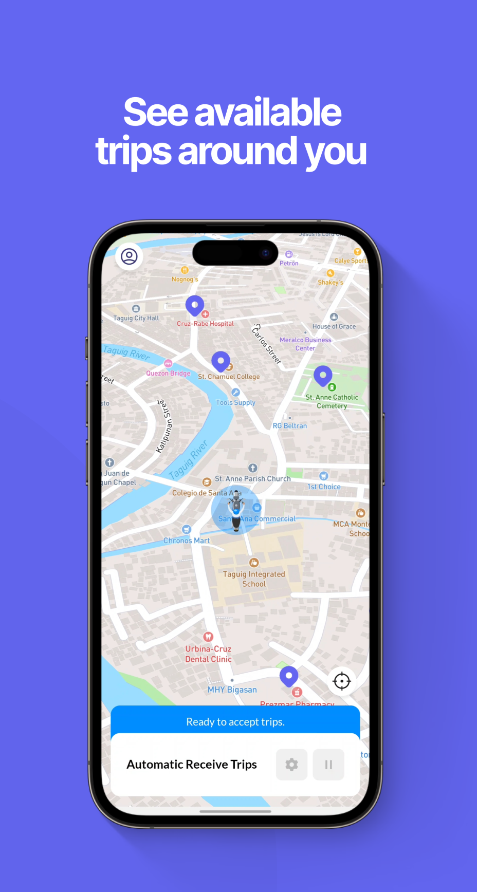
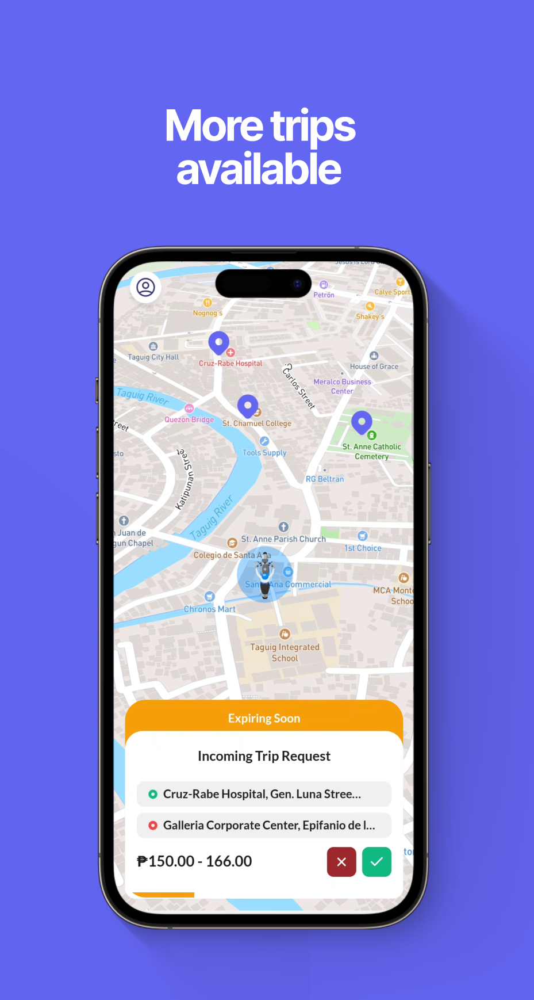
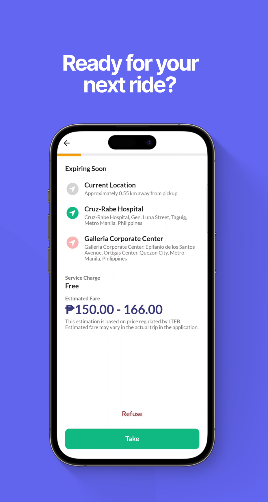

## 
PasaHero Driver

<h4>Ride-hailing platform aggregator for Drivers</h4>

    

    

        
        
        
        
        
        
        
        
        
    

 

    

        
        
        
        
        
    

## Overview

PasaHero is your online barker — an aggregator of leading ride-hailing platforms in the Philippines.

The PasaHero system was built so passengers no longer double-book across different platforms, making it faster to find a driver. In the PasaHero app, the system matches each passenger request with PasaHero drivers from platforms such as Angkas, JoyRide, Move It, and more. One request — visible on every platform.

## App features

- More trip requests
- Ride first, top-up later
- Flat rate — Not commission based
- Nearby passenger access
- Free in-app calls
- In-app messaging
- Easy to register

## Supported Platform

You can register with your platform profile:

- Angkas
- JoyRide
- MoveIt

## Tools Used

- [Javascript](https://developer.mozilla.org/en-US/docs/Web/JavaScript): Core language for app logic
- [React](https://react.dev/): UI component library
- [Expo](https://docs.expo.dev/): Mobile build tooling and native APIs
- [React Native](https://reactnative.dev/): Cross-platform iOS and Android framework
- [Growthbook](https://docs.growthbook.io/): Feature flagging and experimentation
- [H3](https://h3geo.org/): Geospatial indexing system
- [Mapbox](https://www.mapbox.com/): Default map display
- [Google Maps](https://mapsplatform.google.com/): Autocomplete, Places, Directions, Distance Matrix
- [Cloud Run](https://cloud.google.com/run): Serverless backend deployment
- [Golang](https://go.dev/): Backend APIs and services
